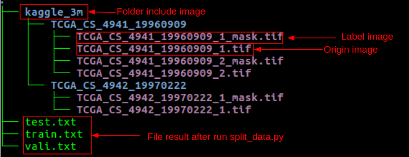

# Brain tumor segmentation on MRI image 

We will build segmentation networks to detect tumor of a brain on the MRI image.

Network architectures which are used is Deeplab v3+ with resnet 101 backbone and Unet.
 

## Getting Started

Before start training, let prepare environment and data

### Prerequisites
### Installing env
We recommend you to use Virtualenv to manage your libraries
- Python 3.5 or Python 3.6
- File `requirements.txt` include all libraries 

Install libraries:
```
pip install -r requirements.txt
```

### Prepare data

Download data from  [Kaggle](https://www.kaggle.com/mateuszbuda/lgg-mri-segmentation)

Extract it to a folder. 

Create train, validation, test set with below command 

```
python data_preprocess/split_data.py --root_dir xxx --output_link yyy
```

- `root_dir`: directory include all image original and label after extract data from zip file
- `output_link`: link to directory to save file `train.txt, validation.txt, test.txt` 

Output folder will have structures like below:


## Running the tests

Explain how to run the automated tests for this system

### Break down into end to end tests

Explain what these tests test and why

```
Give an example
```

### And coding style tests

Explain what these tests test and why

```
Give an example
```

## Deployment

Add additional notes about how to deploy this on a live system

## Built With

* [Dropwizard](http://www.dropwizard.io/1.0.2/docs/) - The web framework used
* [Maven](https://maven.apache.org/) - Dependency Management
* [ROME](https://rometools.github.io/rome/) - Used to generate RSS Feeds

## Contributing

Please read [CONTRIBUTING.md](https://gist.github.com/PurpleBooth/b24679402957c63ec426) for details on our code of conduct, and the process for submitting pull requests to us.

## Versioning

We use [SemVer](http://semver.org/) for versioning. For the versions available, see the [tags on this repository](https://github.com/your/project/tags). 

## Authors

* **Billie Thompson** - *Initial work* - [PurpleBooth](https://github.com/PurpleBooth)

See also the list of [contributors](https://github.com/your/project/contributors) who participated in this project.

## License

This project is licensed under the MIT License - see the [LICENSE.md](LICENSE.md) file for details

## Acknowledgments

* Hat tip to anyone whose code was used
* Inspiration
* etc
