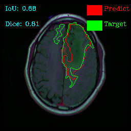

# Brain tumor segmentation on MRI image 

We will build segmentation networks to detect tumor of a brain on the MRI image.

Network architectures which are used is Deeplab v3+ with resnet 101 backbone and Unet.
 

## Getting Started

Before start training, let prepare environment and data

### Prerequisites
### Installing env
We recommend you to use Virtualenv to manage your libraries
- Python 3.5 or Python 3.6
- File `requirements.txt` include all libraries 

Install libraries:
```
pip install -r requirements.txt
```

### Prepare data

Download data from  [Kaggle](https://www.kaggle.com/mateuszbuda/lgg-mri-segmentation)

Extract it to a folder. 

Create train, validation, test set with below command 

```
python data_preprocess/split_data.py --root_dir xxx --output_link yyy
```

- `root_dir`: directory include all image original and label after extract data from zip file
- `output_link`: link to directory to save file `train.txt, vali.txt, test.txt` 

Output folder will have structures like below:


Files train.txt, vali.txt, test.txt include lines. Each lines compose sub-links to file image origin and image label with tab separate

Example
```
TCGA_CS_4941_19960909/TCGA_CS_4941_19960909_1.tif   TCGA_CS_4941_19960909/TCGA_CS_4941_19960909_1_mask.tif
TCGA_CS_4941_19960909/TCGA_CS_4941_19960909_2.tif   TCGA_CS_4941_19960909/TCGA_CS_4941_19960909_2.tif
```
## Running the training and inference 

To training run `python train.py --`
```
python train.py --root_folder /root/data/kaggle_3m \
                --train_data /root/data/train.txt \
                --validation_data /root/data/vali.txt \
                --trainer_save_dir /root/data/save_dir
```
- **root_folder**: folder include image origin and image label
- **train_data**: file include link to train data
- **validation_data**: file include link to validation data
- **trainer_save_dir**: Folder where results(log, checkpoint, tensorboard) will be saved.

## Results:

I got 0.815 IoU with Deeplab v3+ resnet 101 and 0.796 with Unet.

Some inference image segment by deeplab: 

|  | |  |  |
:-------------------------:|:-------------------------:|:-------------------------:|:-------------------------:
|  | |  |  |
|  | |  |  |
|  | |  | |

Replace data with other binary dataset(lung segmentation):

|  | |  |  |
:-------------------------:|:-------------------------:|:-------------------------:|:-------------------------:
|  | |  |  |

## Contributing

## Authors


## License

This project is licensed under the MIT License

## Acknowledgments

